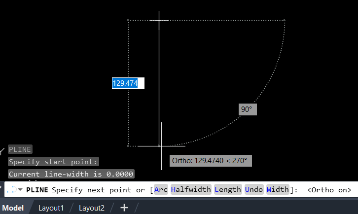
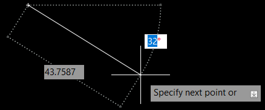
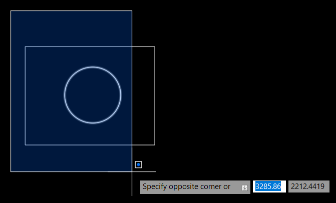
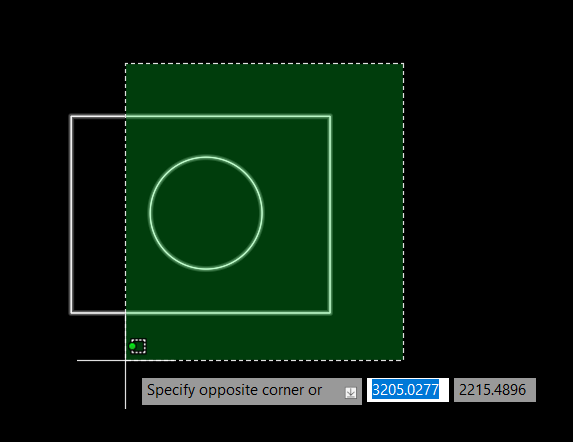
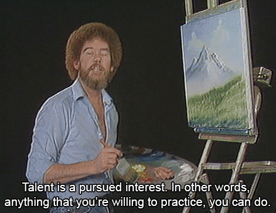

# 🏃 "Quick start" pamācība kursā "CAD programmatūra ģeoloģijā"

`Matīss Brants 2024`✍️

## **☕ 1. Darba sākšana**

### 1.1 Faila atvēršana
Lai atvērtu jaunu failu, klikšķinām uz `New` augšējā kreisajā rīkjoslā (horizontāli pagriezta papīra lapa).
Kad atveras `Select template` logs, atstājam izvēlētu `acadiso.dwt` un spiežam `Open`. Ja darbavietā ir jābalstās uz specifisku noformējumu, var palūgt izveidot šādu template, vai arī vienkāršāk - atvērt vecu failu un būvēt jauno rasējumu, balstoties uz tā.

### 1.2. Faila saglabāšana

Uzreiz saglabājam failu ar `Ctrl + S`. Izdomājam faila nosaukumu, un pārbaudam, kādā versijā glabājam failu - ja, piemēram, projektētājiem ir AutoCAD 2017 versija, tad būs jāsaglabā kā AutoCAD 2013 failu.

**❗❗❗ Atcerieties regulāri saglabāt failu ar `Ctrl + S` vai ar 💾, lai nebūtu atkal jāvaino suni, ka darbs tika apēsts! 🐕**

### 1.3. Darba vides iestatījumi

Ja vēlamies noņemt fona tīklu - `F7`. Ja vēlaties uzlikt citu fona krāsu, klikšķinām uz sarkanās `ACAD` pogas ekrāna augšējā kreisajā stūrī, tad uz `Options`. Logā klikšķinām uz cilnes `Display` un `Colors`. Tad logā `Drawing Window Colors`, izvēloties `Uniform background` nomainām `Color` uz `Black` vai kaut vai rozā, ja tāda vēlme 🌈.

## **🎨 2. Zīmēšana**

### 2.1. Pārvietošanās zīmējumā

- `Peles ritulis (MMB) uz priekšu/atpakaļ` - pietuvinām/attālinām
- `Turam MMB un kustinām peli` - pārvietojam skatu pa rasējumu
- `MMB dubultklikšķis` - iekļaut ekrānā visus elementus (noder, ja kafijas pauzē kaķis 🐈 spēlējies ar peli, un rasējums kaut kur aizmucis)

❗ Ar Mac datoriem ir citādāk, bet viss ir izdarāms. Tur gan jums pašiem jāmeklē šīs funkcijas.

### 2.2. Līnijas un figūras
Izmantojot klaviatūru, rakstām funkcijas (vai arī meklējam pogas augšējā rīkjoslā):

- `PL jeb POLYLINE` - polilīnija
- `REC jeb RECTANGLE` - taisnstūris
- `C jeb CIRCLE` - aplis
- `E jeb ELLIPSE` - elipse
- `SPL jeb SPLINE` - līklīnija

Katrai līnijai un figūrai varam norādīt izmērus. Līnijai tas ir garums, aplim tas ir rādiuss (bet šo var mainīt), taisnstūrim tās ir abas malas (otras malas garumu var norādīt, pārslēdzoties ar `Tab`), elipsei tās ir abas asis.

📏 Bet kādās mērvienībās zīmēt? [Jebkādās! AutoCAD izmanto bezdimensiju sistēmu.](https://www.autodesk.com/blogs/autocad/autocad-drawing-units/) Galvenais, pārliecināties, ka zīmējat pienācīgā mērogā. Ģeoloģijā ir maza jēga no kilometriem vai milimetriem, tādēļ labāk pieņemt ka bezdimensiju vienības ir metri vai centimetri. Ir iespējams iestatīt mērvienības, taču tās ir būtiskas tikai tad, kad atliekam izmērus rasējumā. Funkcionāli tās neko nemaina.

Ja vēlamies zīmēt vertikāli un horizontāli, ieslēdzam Ortogonālo režīmu ar `F8`. Apakšējā komandrindā (baltais logs) parādās `<Ortho on>`:

Ja vēlamies zīmēt polilīniju ar specifisku leņķi, tad, uzsākot tās zīmēšanu, noklikšķinām `Tab`, kas ļauj ievadīt leņķi: (bet, protams, jāizslēdz ortogonālo režīmu ar `F8`)

### 2.3. Elementu izvēle

Ar kursoru uzbraucot uz kādas līnijas vai elementa, tie izgaismojas. Ar kreiso peles klikšķi tos varam atlasīt. 

Taču atlasīt var arī ar rāmi, ja kursors neatrodas uz kāda elementa. Noklikšķinām ar kreiso peles taustiņu, un tad velkam:
- uz labo pusi, lai izvēlētos visus elementus *rāmja iekšpusē*:

- vai uz kreiso pusi, lai izvēlētos visus elementus *kam rāmis pieskarās*:

- Ja divas līnijas pārklāj vienu otru, varam rotēt to izvēli, uzbraucot uz tām ar kursoru un tad turot `Shift` un klikšķinot `Space`.

### 2.4. Elementu pārveidošana

- Taustiņš `Delete` - izvēlētā elementa dzēšana
- `CO jeb COPY` - kopēt
- `M jeb MOVE` - pārvietot
- `RO jeb ROTATE` - pagriezt
- `EX jeb EXTEND` - pagarināt līniju līdz nākamajai līnijai (ar šo var darboties arī advancētāk, taču pameklējiet paši)
- `TR jeb TRIM` - apgriezt līniju līdz tuvākajai šķērsojošai līnijai
- `X jeb EXPLODE` - sadalīt saliktu elementu pa daļām
- `Ctrl + Z` - darbība atpakaļ
- `Ctrl + Y` - darbība uz priekšu
- `OOPS` - atgriezt atpakaļ iepriekš izdzēstus elementus, pat ja ir jau uzzīmēti jauni

### 2.5. Līniju *snepošana* (snapping)

Lai *piesnepotu* līniju pie noteikta punkta uz cita elementa, jāieslēdz `Osnap` režīmu ar `F3`. Tad var izmantot komandu `OSNAP`, lai izvēlētos, kādas *snepošanas* iespējas mums vienmēr tiek piedāvātas.

Iesaku vienmēr atstāt **ie**slēgtu `Endpoint`, `Midpoint`, `Center` un `Node`. Ļoti iesaku **at**slēgt `Nearest`.

Ja gadījumā esat jau uzvilkuši vai pārvietojat/kopējat līniju, un saprotiet, ka nav iespēja *piesnepoties* pie pareizā punkta, tad turiet `Shift` un noklikšķiniet peles labo taustiņu. Parādīsies logs ar *snepošanas* punktu izvēli. Ņemiet vērā, ka tie darbojas tikai **vienu** reizi - ja vēlaties izmantot vēlreiz, būs atkal jāatver to pašu logu.

 
## 🎛️ **3. Elementu iestatījumi (properties)**

### 3.1. Slāņi

Slāņus varam aplūkot caur `Layer Properties` augšējās rīkjoslas vidū vai ar komandu `LA jeb LAYER`.
Būtiskas funkcijas (cipari attēlā):
1. Pievienot jaunu slāni
2. Ieslēgt/izslēgt slāņa redzamību
3. Ieslēgt/izslēgt slāņa redzamību *uz printētas/eksportētas lapas*
4. Nomainīt slāņa krāsu
5. Nomainīt līnijas tipu (nepārtraukta, pārtraukta, punktveida utml.)
6. Nomainīt līnijas platumu
   

❗ Lai līnijas platums būtu redzams rasēšanas skatā, ir jāatver `Lineweight Settings` ar komandu `LINEWEIGHT` un jāieķeksē `Display Lineweight`:

### 3.2. Atsevišķu elementu iestatījumi

Ja vēlaties izmainīt atsevišķa elementa iestatījumus, neatkarīgi no slāņa iestatījumiem, tad to jāizvēlas un jāspiež `Ctrl + 1`:

## ⏸️ Pirmās daļas beigas.

Tas pagaidām viss, bet turpinājums sekos! Veiksmi un galvenais - trenējieties!

